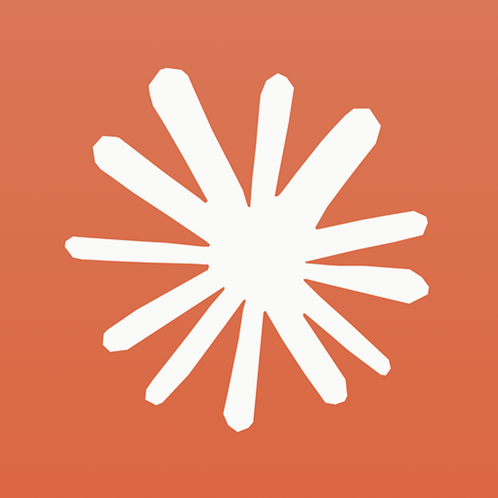
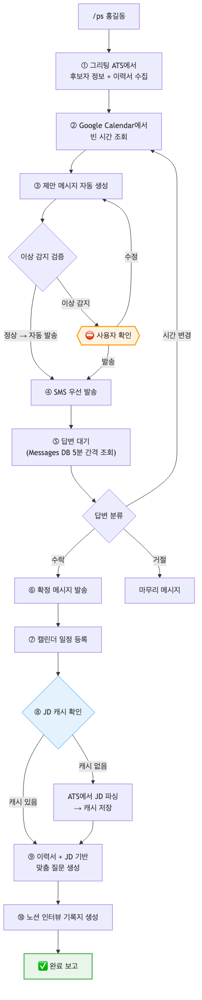
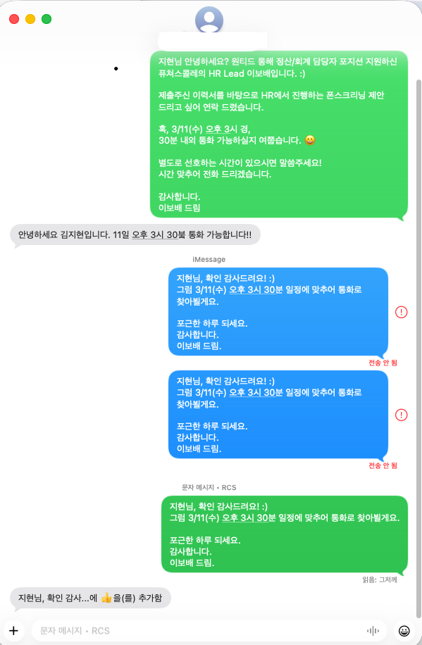
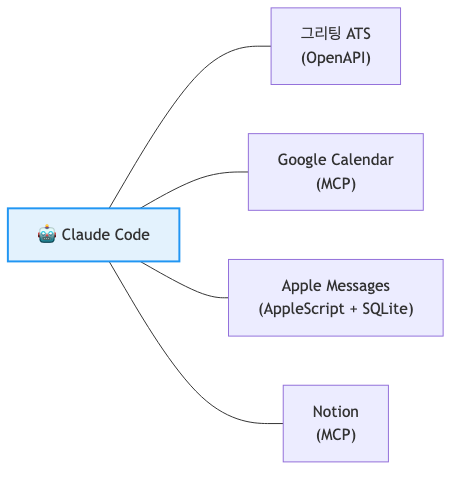
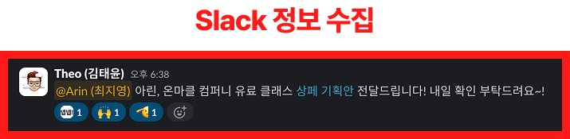
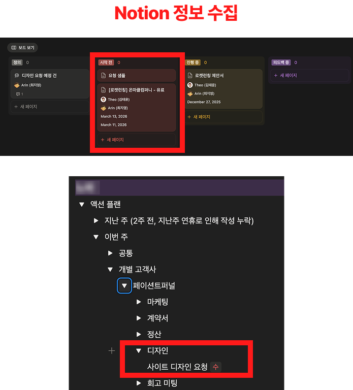
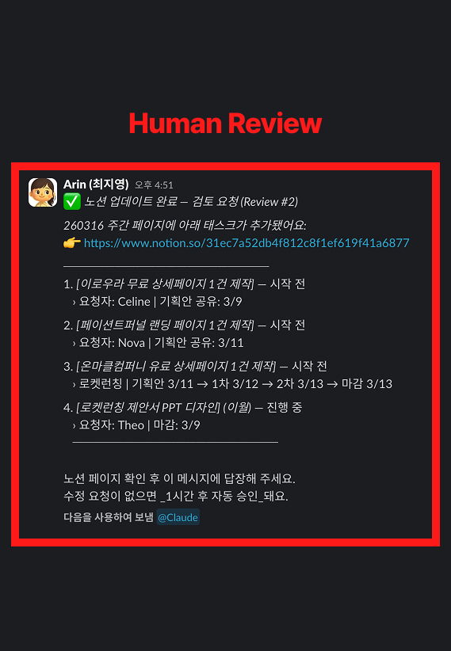
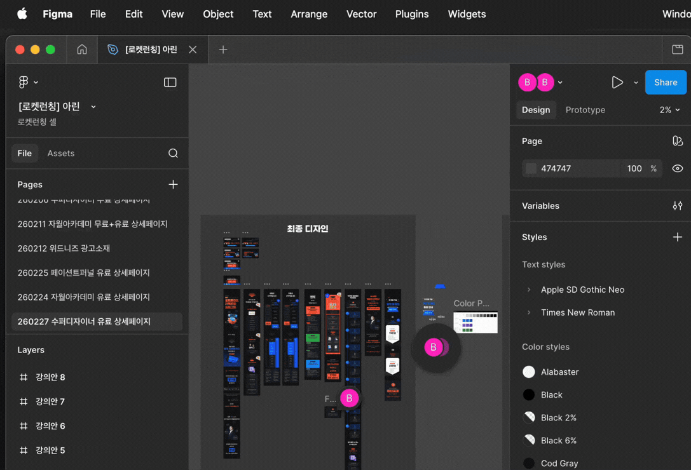
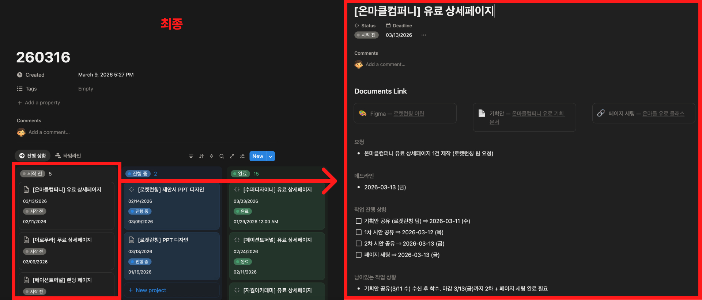
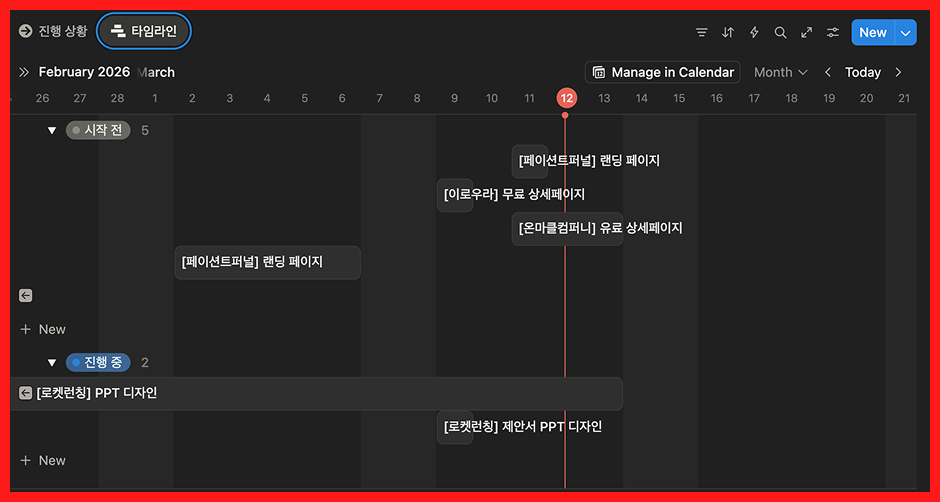

<!-- _class: title -->
<!-- _paginate: false -->

# 터미널 하나로,
# 일하는 방식이 바뀌다.

## AI Native Camp — Session 5

LiveKlass 세일즈·운영팀 × Claude Code
2026. 3. 13

---

<!-- _class: dark -->
<!-- _paginate: false -->

# AI 에이전트를 사내에 배포하려다
# 멈췄다.

---

# 왜 멈췄는가

"AI 도구를 잘 쓰는 기업" ≠ **AI-Native한 기업**

- 에이전트를 만들어 배포하면? → 만든 사람만 할 줄 아는 조직
- 개인이 10x 하는 것보다, **조직이 5x 되는 게 임팩트는 비교할 수 없다**

AI-Native 서비스를 만들어야 한다
← AI-Native 조직에서 그런 서비스가 나온다
← **모든 구성원이 일하는 방식 자체를 바꿔야 한다**

---

<!-- _class: dark -->

# 그래서, AI Native Camp

도구도 알려주고, 개념도 알려주지만 —
**멘탈모델을 바꾸는 캠프**

---

<!-- _class: dark -->

# 2주 전, 우리는 이렇게 시작했습니다.

"자동화하고 싶은 업무 1가지를 가져오세요."

---

<!-- _class: with-logo -->

# 캠프 여정

| 세션 | 주제 | 한 줄 요약 |
|------|------|-----------|
| Session 1 | 설치 + 첫 체험 | "와, 이걸로 이게 되네?" |
| Session 2 | GitHub 설정 관리 | 내 설정을 어디서든 동기화 |
| Session 3 | 도구 연결 + Context Sync | Slack·Notion·시트를 하나로 |
| Session 4 | 산출물 PR 제출 | 만든 것을 공유하고 리뷰하기 |
| **Session 5** | **사내 공유회** | **오늘, 우리가 만든 것들** |

---

<!-- _class: dark -->
<!-- _paginate: false -->

# 우리가 만든 것들

---

# 김성원 (Ethan)

> 거래처 사업자정보 자동 검증 — 412개 채널 × 6개 항목, 사람 눈 대신 AI로

**문제**: 2,000+ 거래처의 사업자등록증 정보를 시트와 수동 대조 → **30시간+** (사실상 불가능)

**해결**: Claude 멀티모달로 등록증 이미지 자동 읽기 + 시트 자동 대조

**결과**: 명령어 한 줄로 **1,970셀 전량 대조**, 343건 불일치 자동 수정 + 색상 표시

---

<!-- _class: ba-table -->

# 김성원 (Ethan) — Before / After

| 지표 | Before (수동) | After (AI) |
|------|:---:|:---:|
| 검증 범위 | 일부만 (시간 부족) | **412개 채널 전수 검증** |
| 소요 시간 | 30시간+ (사실상 불가능) | **수십 분** |
| 검증 셀 수 | 눈에 띄는 것만 | **1,970셀** (343건 수정) |
| 미세 차이 감지 | 높은 누락 위험 | **띄어쓰기까지 감지** |

> "사람 눈으로 불가능한 전수 검증이, AI로 가능해졌다."

---

# 김성원 (Ethan) — 검증 파이프라인

---

# 김성원 (Ethan) — 왜 AI여야 했는가

**멀티모달 AI = 문서를 "눈으로 읽는" AI**

- 기존 OCR: 글자 모양만 인식 → 레이아웃 달라지면 실패
- **멀티모달 AI**: 문서의 구조와 맥락을 이해 → 469개 서로 다른 형식의 등록증을 템플릿 없이 일괄 처리

**컬럼별 불일치 분포** (총 343건)

| 항목 | 수정 건수 | 주요 원인 |
|------|:---:|------|
| 주소 | **140건** | 주소 이전, 도로명/지번 혼용 |
| 종목 | 86건 | 종목 변경 미반영 |
| 업태 | 62건 | 업태 추가/변경 미반영 |
| 상호명 | 31건 | 상호 변경, 법인명 표기 차이 |
| 대표자명 | 16건 | 공동대표 구분자 불일치 |
| 사업자번호 | 8건 | 번호 오타 |

---

# 김태윤 (Theo)

> 로켓런칭 리드 자동 분석 — "리드 분석해줘" 한 마디로 심사까지

**해결하고 싶은 문제**

- 신규 신청자 1명당 시트 → Notion 옮기기 + 적합도 판단에 **30분~1시간**
- 신청자가 늘면 단순 반복 작업이 기하급수적으로 증가
- **평가 기준이 담당자별로 달라** 커뮤니케이션 비용 발생

---

# 김태윤 (Theo) — 기존 방식의 병목

| 병목 | 설명 |
|------|------|
| 수동 데이터 이관 | 구글 시트 → Notion 복붙, 1명당 5~10분 |
| 기준 불일치 | 평가 기준이 머릿속에만 → 판단 일관성 부족 |
| 중복 처리 실수 | 이미 등록된 신청자를 다시 처리 |
| 확장 불가 | 신청자 증가 시 리소스 감당 어려움 |

---

# 김태윤 (Theo) — 지향했던 방향성

- `리드 분석해줘` **한 마디**로 전체 프로세스 + 결과 도출까지 자동 진행
- 각자 머리에만 있는 평가 기준을 **명문화** → AI가 일관성 있게 적합도 제안
- 팀 피드백 → AI 평가 기준이 **자동 개선**되는 자기학습 구조

> 실은 시트에 신청자가 추가되면 알아서 프로세스가 돌아가는 **완전 자동화**를 원했음

---

# 김태윤 (Theo) — 현재 구현 단계

`리드 분석해줘` 한 마디로 **1차 심사 전체 파이프라인 실행**

1. 구글 시트에서 신청자 데이터 **자동 수집**
2. Notion DB **중복 체크** → 신규 신청자만 분석
3. 5개 항목(웨비나 적합도·SNS 브랜딩·성공사례·강사 온도·전환 준비도) **100점 기준 AI 분석**
4. Notion 페이지 **자동 생성** (원문 + 분석 + 예상 질문 + 미팅 노트 템플릿)
5. Slack DM으로 **분석 결과 요약 발송**
6. 팀 판단 메모 → AI 불일치 패턴 분석 → **평가 기준 자동 업데이트**

---

# 김태윤 (Theo) — 시연

`리드 분석해줘` → 수집 → 중복 체크 → AI 분석 → Notion 생성 → Slack 알림까지 **자동 실행**

---

# 김태윤 (Theo) — 추후 과제

- **자기학습 루프 실전 검증** — 팀 피드백 → AI 기준 자동 업데이트 (아직 미경험)
- **"분석 등급 vs 실제 매출" 상관관계 검증** — 데이터가 쌓이면
- 신청자 증가 시 **배치 처리 성능 최적화**
- 1차 서류 심사 → **2차 필터링, 3차 온라인 미팅**까지 동일 프로세스 확장

---

# 김태윤 (Theo) — 배운 점

- AI에 대한 **막연한 두려움이 해소**되었다 — 꾸준히 관심 갖고 물어보면 문제없다
- 현재 업무를 **단계별로 해체하는 것**이 자동화의 첫 단계 — 기준과 프로세스를 언어화·명문화
- Slack·Notion 같은 **실제 업무 도구와 연결**하면서, 조언자 AI가 진짜 도구 AI가 되었다

> "내가 더 편해져서 만든 건데, 회사만 좋게 생겼네 에이"

---

# 이보배 (Vivi)

> 폰스크리닝 자동화 — `/ps 홍길동` 한 줄이면 끝

**문제**: 후보자 1명당 일정 조율 → 메시지 발송 → 답변 대기 → 캘린더 → 인터뷰 기록지… **30~40분**

**해결**: Claude Code 스킬 `/ps`로 전체 플로우 자동화

---

# 이보배 (Vivi) — /ps 워크플로우

`/ps 홍길동` → 10단계 자동 실행. 이상 감지 시에만 사용자 확인

---

<!-- _class: split -->

# 이보배 (Vivi) — 실제 동작 화면

`/ps` 한 줄로 생성된 **실제 iMessage 대화**
제안 → 수락 → 확정까지 자동 처리

---

# 이보배 (Vivi) — 연동 서비스 구조

**4개 외부 서비스를 비개발자가 직접 연결** — OpenAPI · MCP · AppleScript + SQLite

---

<!-- _class: ba-table -->

# 이보배 (Vivi) — 실사용 개선 사례

| | Before | After |
|---|:---:|:---:|
| 퍼미션 승인 | 매 단계 승인 버튼 **10회** 클릭 | **에이전트 자율 실행** — 이상 시에만 중단 |
| 메시지 발송 | iMessage 우선 → Android 실패 (3회 시도) | **SMS 우선 발송** → 1회 시도로 성공 |

> "실제로 돌려보니 발견한 문제를, 직접 고쳤다."

---

<!-- _class: ba-table -->

# 이보배 (Vivi) — Before / After

| | Before | After |
|---|:---:|:---:|
| 1건당 전후 작업 | 30~40분 | **2~3분 (~93% 절감)** |
| 4명 몰리는 날 | 반나절 | **10분 (~95% 절감)** |
| 질문 퀄리티 | 컨디션 따라 들쭉날쭉 | **이력서+JD 기반 일관된 품질** |

**연동 서비스**: 그리팅 ATS · Google Calendar · Apple Messages · Notion

> "비개발자가 4개 서비스를 연결하고, 후보자 통화 제외한 폰스크리닝 전후 업무의 93%를 자동화했다."

---

# 이보배 (Vivi) — 다음 목표: 채용 풀퍼널 자동화

**폰스크리닝은 시작일 뿐 — 채용 전 과정을 자동화해 나갈 계획**

| 과제 | 설명 | 상태 |
|------|------|:---:|
| 채용 브랜딩 에이전트 | 회사·팀 소개 콘텐츠 자동 생성 | 예정 |
| 다이렉트 소싱 | 링크드인·원티드 등 후보자 제안 발송 자동화 | 예정 |
| 대면 인터뷰 어레인지 | 면접관 + 후보자 일정 조율 → 캘린더·회의실·안내 | ✅ `/arrange` 구현 완료 |
| 다중 후보자 일괄 처리 | 동시에 여러 명에게 제안 메시지 발송 | 예정 |

후보자 통화는 자동화하지 않는다 — **AI면접관 도입 계획 (아직) 없음**

> "자동화의 목적은 모든 것을 자동화하는 게 아니라, 사람이 해야 할 일에 집중할 수 있도록 나머지를 덜어주는 것"

---

# 최재훈 (Terry)

> CX 어시스턴트 — 상담 스크린샷 하나로 분류·검색·응대까지

**문제**: 채널톡 문의마다 VoC 시트·Notion·Slack을 **각각 수동 탐색**
신규 입사자일수록 맥락 파악에 시간이 걸려 응답이 느려짐

**해결**: 채널톡 상담 스크린샷을 첨부하면 4단계 자동 처리

| 단계 | 내용 |
|:---:|------|
| 1. 분류 | 문의 주체·트랙·결제수단·귀책 자동 태깅 |
| 2. 통합 검색 | VoC 시트 + Notion + Slack 유사 케이스 (링크 포함) |
| 3. 응대 초안 | 복붙 → 수정만 하면 되는 메시지 생성 |
| 4. 에스컬레이션 | 리드 문의 vs 개발팀 문의 기준 자동 판단 |

---

# 최재훈 (Terry) — 핵심 가치

**경험에 의존하던 암묵지를 시스템으로**

- 내부 가이드에 명시되지 않은 문의의 경우, 응대 기준이 개인 기억과 주관에 의존 → **SKILL.md에 명문화**
- 유사 케이스 검색을 사람 기억이 아닌 **3개 소스 자동 통합 탐색**으로
- 신규 CX 매니저도 온보딩 시 이 스킬로 **동일한 품질 대응 가능**

> "누구든 동일한 품질로, 빠르게 대응할 수 있는 구조"

---

# 최재훈 (Terry) — 추후 목표 1: 검색 속도 최적화

**처리 완료 케이스를 메모리에 패턴화**
- 유사 문의 시 저장된 케이스 **우선 검색** → 응답 속도 향상

**VoC 대시보드 시트 검색 최적화**
- 현재: 불필요한 열까지 전체 조회 → 토큰 초과
- 단기: 태그+요약 열만 **범위 지정 조회** → 속도·토큰 대폭 절감
- 중기: 별도 인덱스 시트(키워드-행번호 매핑) → 전체 스캔 없이 직접 접근

---

# 최재훈 (Terry) — 추후 목표 2: CX 대응 기준 자동 업데이트

**제품 릴리즈·이슈를 CX가 자동으로 파악**

- Slack 제품팀 채널을 **정기 스캔** → 이슈 요약
- **"이번 주 CX 유의사항"** 형태로 자동 문서화
- 한계: CX 관련 이슈인지 필터링이 LLM 판단에 의존 → 초기에는 수시 확인 필요

---

# 이새봄 (Bom)

> 디자인 시스템 자동화 시도기 — "작고 실제로 작동하는 것"

**처음 구상**: Figma 변경 → 토큰 자동 추출 → FE 전달 → Slack 알림까지 한 흐름

**부딪힌 현실**:
- Figma API 접근 불가 (요금제 제약)
- FE 단 자동화는 이미 FE팀이 진행 중

→ 범위를 계속 좁혀서 **내가 통제 가능한 가장 작은 지점**을 찾기로

---

# 이새봄 (Bom) — 구현과 배운 점

**구현**: Notion DB 버튼 클릭 → Slack `#fepd-collab`에 FE 멘션 + 문서 링크 자동 발송

직접 코드를 짠 것도, API를 연결한 것도 아니다.
Claude Code에 물었더니 **Notion Automations 기능을 알려줬다.**
몰라서 못 쓰고 있던 기능 — 실제로 작동하고, 실무에서 쓰이고 있다.

**보너스**: 디자인 토큰 리부트 시 Claude Code로 **네이밍 일괄 변환 스크립트** 활용

> "자동화의 첫 단계는 코드가 아니라, 내 업무를 들여다보는 것이었다."

---

# 송상수 (Eddie)

> 강의 링크 하나로 리드마그넷 + 워크북 PDF 자동 생성

**문제**: 영상 강의의 핵심을 빠르게 학습하고 실천으로 연결하고 싶은데, 자막 추출 → 요약 → 재구조화까지 **5단계 수작업**

**해결**: `/product_create` 커맨드 하나로 스크래핑 → 요약 → 워크북 + 리드마그넷 PDF 원스톱 생성

**결과**: 고객사 강의 링크만 입력하면 **상용화 수준의 PDF 3종** 자동 생성

---

# 송상수 (Eddie) — 고객사 적용 시나리오

**라클 고객사에게 제공하는 가치**

| 산출물 | 용도 |
|------|------|
| 요약본 PDF | 강의 핵심 내용 빠른 학습 |
| 실전 워크북 PDF | 강의 기반 실천 가이드 |
| 리드마그넷 PDF | 잠재고객 유입용 무료 콘텐츠 |

> "내 강의를 선택하기만 하면, 리드마그넷이랑 워크북이 자동으로 나와요"

핵심은 엔진 구현보다 **프롬프트 반복 개선으로 상용화 수준 퀄리티 확보**

---

# 최지영 (Arin)

> 디자인 요청 취합 에이전트 — Slack·Notion에 흩어진 요청, AI가 알아서 모아준다

**문제**: Slack 2개 채널 + 개인 DM + Notion 등 4개 채널에서 들어오는 디자인 요청을 수동 취합 & 정리에 약 **30분가량** 소요

| 병목 | 설명 |
|------|------|
| 요청 경로 파편화 | 4개 채널에서 각각 수동 확인 |
| 요청 형식의 다양성 | 요청자마다 형식이 달라 재확인 필요 |
| 수동 복제 관리 | 전주 Task → 차주 Task 수동 복제·수정 |
| 정보 누락 | Figma·기획안·클래스 링크 등 빠짐 |

---

<!-- _class: split -->

# Step 1 — 수집1

**Slack 2채널 + DM을 1시간마다 자동 스캔**
월~금 9시~19시, 정각마다 디자인 관련 메시지 수집

---

<!-- _class: split -->

# Step 1 — 수집2

Notion 액션 플랜의 **디자인 요청도 함께 수집**
Slack + Notion, 흩어진 요청을 한 곳으로

---

<!-- _class: split -->

# Step 2 — Human Review

수집된 후 필터링된 요청을 **Slack DM으로 Arin에게 전송**
확인 후 승인 — 1시간 무응답 시 자동 승인

---

<!-- _class: split -->

# Step 3 — Figma 페이지 자동 생성

신규 Task → **Figma 플러그인 버튼 한 번**으로
페이지 자동 생성 + Notion Task에 링크 삽입

---

# Step 4 — Notion 최종 결과

칸반 보드 + 개별 Task 상세 — **Figma 링크, 기획안, 데드라인, 작업 단계**까지 자동 기입

---

# Step 5 — 타임라인 자동 계산

---

<!-- _class: ba-table -->

# 최지영 (Arin) — Before / After

**"뚜렷한 작업 플로우 + 디테일한 조건만 잘 제시해준다면 누구나 쉽게 가능하다"**

| | Before | After |
|---|:---:|:---:|
| 요청 경로 파편화 | 4개 채널 수동 확인 | **모든 경로에서 자동 수집** |
| 요청 형식 다양성 | 재확인·재정리 필요 | **설정 형식에 맞게 자동 정리** |
| 수동 복제 관리 | 전주 Task 수동 복제·수정 | **자동 복제 관리** |
| 정보 누락 | Figma·기획안 링크 빠짐 | **자동 수집·필터링으로 누락 방지** |

**연동 서비스**: Slack · Notion · Figma · Cron 스케줄러

---

# 정영현 (Jay)

> 여기에 산출물 요약이 들어갑니다.

**문제**: (SHOWCASE.md 제출 후 채움)
**해결 방향**:
**현재 구현**:

---

<!-- _class: big-number -->

# 7명

비개발자가 터미널에서 자기 업무를 자동화했습니다.

---

<!-- _class: dark -->
<!-- _paginate: false -->

# 쉬는 시간

5분 후 2부가 시작됩니다

---

<!-- _class: dark -->
<!-- _paginate: false -->

# 2부 — Keynote

### 조직이 AX를 정석적으로 실패하는 방법

특별 외부 연사 *(별도 슬라이드)*

---

<!-- _paginate: false -->

# 패널토크

### 우리 조직은 어떻게 AX를 할 수 있을까?

| | 패널 |
|---|------|
| 앰버서더 | Ian (김영호) · Eddie (송상수) |
| 참여자 대표 | Vivi (이보배) |

What to do & How to do

---

<!-- _class: with-logo -->

# 다음 스텝

- **1기 수료생이 각 팀에서 캠프, AX타임, 정기 세션 등을 시도** — 팀 내 전파자 역할
- **전 구성원 Claude Code 온보딩**이 목표 — 터미널에서 쓸 줄 아는 것과 모르는 것의 차이는 크다
- **AX Meetup 정기 개최** — 관성으로 돌아가지 않기 위해

> "도구는 배우는 게 아니라, 쓰면서 익히는 겁니다."

---

<!-- _class: ending -->
<!-- _paginate: false -->

# THANK YOU

Made with Claude Code × Marp
*simple is best*

